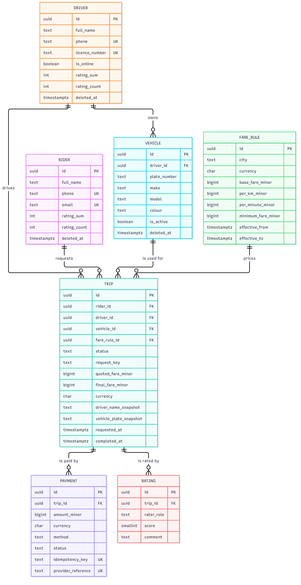
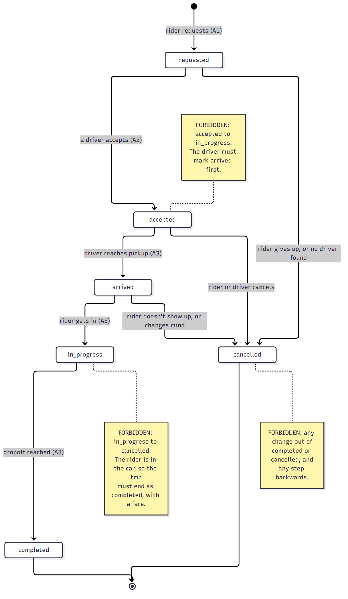

# Ride-Hailing: API Design and Data Model

A complete design for a ride-hailing service in Lagos and Abuja: the requirements, the data model,
the decisions behind it, and the API contract. It's written before any application code, as the
document a team would agree on first.

Only the **database** is built, to prove the model holds: the schema with its constraints and
indexes, sample data, the queries behind the five key actions, their query plans, and six invalid
states the database refuses to store.

## The design, in order

| Document                                            | What's in it                                                                                     |
| --------------------------------------------------- | ------------------------------------------------------------------------------------------------ |
| [1. Requirements](docs/1-requirements.md)           | what the product does, who uses it, the five key actions (A1 to A5), and the business rules (R1 to R8) every later decision points back to |
| [2. Data model](docs/2-data-model.md)               | every entity with its fields and types, the relationships and their cardinality, and the diagram |
| [3. Decisions](docs/3-decisions.md)                 | normalisation (and four deliberate copies), money, the trip state machine, deletion, identifiers, constraints ("which invalid states are impossible?"), and indexes |
| [4. API design](docs/4-api.md)                      | every endpoint with its request, response, errors, and idempotency; the pagination contract; over-fetching (REST vs GraphQL); real-time (SSE vs WebSocket) |

## The diagrams

**Entities and relationships** (source: [`docs/diagrams/data-model.mmd`](docs/diagrams/data-model.mmd)):



**Trip state machine**, allowed changes as arrows and forbidden ones as notes (source:
[`docs/diagrams/trip-states.mmd`](docs/diagrams/trip-states.mmd)):



## Proof that the model holds

| What                                   | Where                                                                                           |
| -------------------------------------- | ----------------------------------------------------------------------------------------------- |
| Schema: tables, constraints, triggers, indexes | [`sql/001_schema.sql`](sql/001_schema.sql)                                              |
| Sample data: 3,000 riders, 400 drivers, 20,000+ trips | [`sql/002_seed.sql`](sql/002_seed.sql)                                           |
| The queries behind A1 to A5            | [`sql/003_queries.sql`](sql/003_queries.sql)                                                    |
| All five actions run on one trip, request to rating | [`docs/evidence/five-actions.txt`](docs/evidence/five-actions.txt)                 |
| Query plans for the two heaviest reads | [`docs/evidence/query-plans.txt`](docs/evidence/query-plans.txt)                               |
| Six invalid states, each rejected      | [`sql/004_invalid_inserts.sql`](sql/004_invalid_inserts.sql) → [`docs/evidence/invalid-inserts.txt`](docs/evidence/invalid-inserts.txt) |

The seed doesn't bypass the rules. Every trip is inserted as `requested` and then moved through its
statuses with updates, like the app would, so all 20,000 trips passed the state machine and every
constraint on the way in.

### The two heaviest queries use their indexes

From [`docs/evidence/query-plans.txt`](docs/evidence/query-plans.txt), against 20,180 trips:

```
A2_find_nearby_requests
  ->  Index Scan using trips_open_requests_location on trips (actual time=0.029..0.039 rows=3 loops=1)
Execution Time: 0.071 ms

A5_trip_history
  ->  Index Scan using trips_rider_history on trips t (actual time=0.015..0.022 rows=6 loops=1)
  ->  Index Scan using ratings_once_per_side on ratings r (actual time=0.005..0.005 rows=1 loops=6)
Execution Time: 0.112 ms
```

### The database refuses invalid states

From [`docs/evidence/invalid-inserts.txt`](docs/evidence/invalid-inserts.txt):

| Attempt                                                      | Rejected by                         |
| ------------------------------------------------------------ | ----------------------------------- |
| A rider requests a second ride while one is in progress      | `trips_one_active_per_rider`        |
| A rating for a trip that hasn't finished                     | `ratings_trip_must_be_completed`    |
| A payment for less than the trip's final fare                | `payments_match_trip_final_fare`    |
| A finished trip moved back to in progress                    | `trips_allowed_transition`          |
| A second Lagos price list overlapping the current one        | `fare_rules_no_overlap`             |
| Cancelling a trip the rider is already in                    | `trips_allowed_transition`          |

## Running the proof yourself

Requirements: Node.js 20+ and a Postgres 13+ database (a free Supabase project works). Everything is
created inside its own `ride` schema, so it can share a database with other projects.

1. Install:
   ```bash
   git clone <this repo>
   cd engineering-task-3-api-design
   npm install
   ```
2. Create `.env` from the example and set `DATABASE_URL`:
   ```bash
   cp .env.example .env
   ```
   In Supabase: **Connect** → **Session pooler**. Put your password in place of `[YOUR-PASSWORD]`,
   without the brackets; write `@` in the password as `%40`.
3. Build the schema and load the sample data (drops and recreates the `ride` schema; about 30 seconds):
   ```bash
   npm run db:reset
   ```
4. Run the five actions on one new trip, and print the query plans (changes are rolled back):
   ```bash
   npm run queries
   ```
5. Try the six invalid states (each one is rolled back):
   ```bash
   npm run invalid
   ```

Each block in [`sql/004_invalid_inserts.sql`](sql/004_invalid_inserts.sql) can also be pasted on
its own into the Supabase SQL Editor to see the rejection there.
