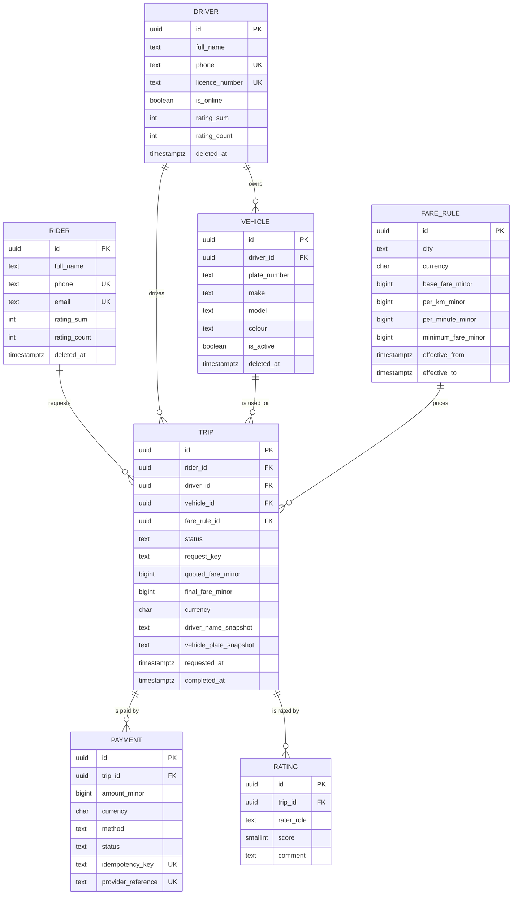

# 2. Data model

Seven entities. Every identifier is a UUID generated by the database (see
[3. Decisions → Identifiers](3-decisions.md#identifiers)). Every entity has `created_at` and
`updated_at`. Entities that can be deleted also have `deleted_at` (see
[3. Decisions → Time and deletion](3-decisions.md#time-and-deletion)).

"Required" means the column is `not null`. "Required when…" means a check constraint makes it
required in certain statuses.

## The diagram

The diagram shows the main columns. The full lists are below, and the exact definitions are in
[`sql/001_schema.sql`](../sql/001_schema.sql).

## Relationships and cardinality

| From         | To           | Cardinality                          | Meaning                                                                    |
| ------------ | ------------ | ------------------------------------ | -------------------------------------------------------------------------- |
| rider        | trip         | one to many                          | A rider requests many trips; each trip has exactly one rider.              |
| driver       | trip         | one to many (optional)               | A driver drives many trips; a trip has no driver until one accepts it.     |
| driver       | vehicle      | one to many                          | A driver may register several cars over time; each car belongs to one driver. At most one is active. |
| vehicle      | trip         | one to many (optional)               | A car is used for many trips; a trip records the car it used once accepted. |
| fare_rule    | trip         | one to many                          | A price list prices many trips; each trip is priced by exactly one.        |
| trip         | payment      | one to many                          | A trip can have several payment attempts (e.g. a declined card, then cash); **at most one** can be live. |
| trip         | rating       | one to at most two                   | A finished trip gets at most one rating from the rider and one from the driver. |
| rider        | driver       | **many to many, through trip**       | A rider rides with many drivers; a driver carries many riders.             |

**Rider ↔ driver is many-to-many, and `trips` is the join table.** Like any join table, it
carries its own constraints. The two most important in the whole design live on it: one active
trip per rider (R1), and one active trip per driver (R2).

## Entities

### `riders`: a person who takes rides

| Field          | Type        | Required                  | Notes                                                         |
| -------------- | ----------- | ------------------------- | ------------------------------------------------------------- |
| `id`           | uuid        | yes                       | identifier, generated                                         |
| `full_name`    | text        | yes, until deleted        | removed when the account is deleted                           |
| `phone`        | text        | yes, until deleted        | unique; Nigerian format `+234` and 10 digits; removed on deletion |
| `email`        | text        | no                        | unique if given; removed on deletion                          |
| `rating_sum`   | integer     | yes, default 0            | total of all scores drivers have given this rider             |
| `rating_count` | integer     | yes, default 0            | how many ratings. Average = `rating_sum / rating_count`       |
| `created_at`   | timestamptz | yes                       |                                                               |
| `updated_at`   | timestamptz | yes                       |                                                               |
| `deleted_at`   | timestamptz | no                        | set when the account is deleted                               |

### `drivers`: a person who gives rides

| Field            | Type        | Required           | Notes                                                    |
| ---------------- | ----------- | ------------------ | -------------------------------------------------------- |
| `id`             | uuid        | yes                | identifier, generated                                    |
| `full_name`      | text        | yes, until deleted |                                                          |
| `phone`          | text        | yes, until deleted | unique                                                   |
| `licence_number` | text        | yes, until deleted | unique                                                   |
| `is_online`      | boolean     | yes, default false | whether the driver is taking requests right now          |
| `rating_sum`     | integer     | yes, default 0     | total of all scores riders have given this driver        |
| `rating_count`   | integer     | yes, default 0     |                                                          |
| `created_at`, `updated_at` | timestamptz | yes      |                                                          |
| `deleted_at`     | timestamptz | no                 | a deleted driver can't be online                         |

### `vehicles`: a car a driver has registered

| Field          | Type        | Required | Notes                                                              |
| -------------- | ----------- | -------- | ------------------------------------------------------------------ |
| `id`           | uuid        | yes      | identifier, generated                                              |
| `driver_id`    | uuid        | yes      | → `drivers.id`                                                     |
| `plate_number` | text        | yes      | unique among cars that are not deleted                             |
| `make`, `model`, `colour` | text | yes | e.g. Toyota, Corolla, Silver                                     |
| `year`         | integer     | yes      | 1990 to 2100                                                       |
| `is_active`    | boolean     | yes      | the car the driver is using now; at most one per driver            |
| `created_at`, `updated_at` | timestamptz | yes |                                                             |
| `deleted_at`   | timestamptz | no       | a retired car; can't be active                                     |

### `fare_rules`: a city's price list for a period of time

| Field                | Type        | Required | Notes                                                       |
| -------------------- | ----------- | -------- | ----------------------------------------------------------- |
| `id`                 | uuid        | yes      | identifier, generated                                       |
| `city`               | text        | yes      | `Lagos` or `Abuja`                                          |
| `currency`           | char(3)     | yes      | ISO code, `NGN`                                             |
| `base_fare_minor`    | bigint      | yes      | starting charge, in kobo                                    |
| `per_km_minor`       | bigint      | yes      | charge per kilometre, in kobo                               |
| `per_minute_minor`   | bigint      | yes      | charge per minute, in kobo                                  |
| `minimum_fare_minor` | bigint      | yes      | no trip costs less than this                                |
| `effective_from`     | timestamptz | yes      | when this price list starts                                 |
| `effective_to`       | timestamptz | no       | when it stops; null means "still current"                   |
| `created_at`, `updated_at` | timestamptz | yes |                                                         |

Price lists are never edited or deleted. A price change closes the old one (`effective_to`) and
adds a new one, so the price behind every old trip can always be looked up.

### `trips`: one ride, from request to finish

| Field                          | Type             | Required                         | Notes                                                    |
| ------------------------------ | ---------------- | -------------------------------- | -------------------------------------------------------- |
| `id`                           | uuid             | yes                              | identifier, generated                                    |
| `rider_id`                     | uuid             | yes                              | → `riders.id`                                            |
| `request_key`                  | text             | yes                              | the app's idempotency key; unique per rider              |
| `city`                         | text             | yes                              |                                                          |
| `fare_rule_id`                 | uuid             | yes                              | → `fare_rules.id`, the price list in force when requested |
| `currency`                     | char(3)          | yes                              | must match the fare rule's                               |
| `status`                       | text             | yes                              | see the [state machine](3-decisions.md#status-and-state) |
| `pickup_lat`, `pickup_lng`     | double precision | yes                              | where the rider is                                       |
| `pickup_address`               | text             | yes                              |                                                          |
| `dropoff_lat`, `dropoff_lng`   | double precision | yes                              |                                                          |
| `dropoff_address`              | text             | yes                              |                                                          |
| `estimated_distance_m`         | integer          | yes                              | from the maps provider when requested                    |
| `estimated_duration_s`         | integer          | yes                              |                                                          |
| `quoted_fare_minor`            | bigint           | yes                              | the price shown to the rider, in kobo                    |
| `driver_id`                    | uuid             | required from `accepted`         | → `drivers.id`                                           |
| `vehicle_id`                   | uuid             | required from `accepted`         | → `vehicles.id`, and must be one of that driver's cars   |
| `driver_name_snapshot`         | text             | required from `accepted`         | driver's name at the time (a deliberate copy)            |
| `vehicle_plate_snapshot`       | text             | required from `accepted`         | plate at the time (a deliberate copy)                    |
| `vehicle_description_snapshot` | text             | no                               | e.g. "Silver Toyota Corolla"                             |
| `actual_distance_m`            | integer          | required when `completed`        | measured during the trip                                 |
| `actual_duration_s`            | integer          | required when `completed`        |                                                          |
| `final_fare_minor`             | bigint           | required when `completed`        | what the rider pays, in kobo                             |
| `requested_at`                 | timestamptz      | yes                              |                                                          |
| `accepted_at`                  | timestamptz      | required from `accepted`         |                                                          |
| `arrived_at`                   | timestamptz      | required from `arrived`          |                                                          |
| `started_at`                   | timestamptz      | required from `in_progress`      |                                                          |
| `completed_at`                 | timestamptz      | required when `completed`        |                                                          |
| `cancelled_at`                 | timestamptz      | required when `cancelled`        |                                                          |
| `cancelled_by`                 | text             | required when `cancelled`        | `rider`, `driver`, or `system` (no driver found)         |
| `cancel_reason`                | text             | no                               |                                                          |
| `created_at`, `updated_at`     | timestamptz      | yes                              |                                                          |

### `payments`: one attempt to pay for a trip

| Field                | Type    | Required               | Notes                                                                |
| -------------------- | ------- | ---------------------- | -------------------------------------------------------------------- |
| `id`                 | uuid    | yes                    | identifier, generated                                                |
| `trip_id`            | uuid    | yes                    | → `trips.id`                                                         |
| `amount_minor`       | bigint  | yes                    | in kobo; must equal the trip's `final_fare_minor`                    |
| `currency`           | char(3) | yes                    | must equal the trip's currency                                       |
| `method`             | text    | yes                    | `card` or `cash`                                                     |
| `status`             | text    | yes                    | `pending`, `succeeded`, `failed`, or `refunded`                      |
| `idempotency_key`    | text    | yes                    | unique: a retried request can't create a second payment              |
| `provider_reference` | text    | required for a successful card payment | the card processor's reference; unique           |
| `failure_reason`     | text    | required when `failed` |                                                                      |
| `created_at`, `updated_at` | timestamptz | yes     |                                                                      |

### `ratings`: one side's score for a finished trip

| Field         | Type     | Required | Notes                                                                |
| ------------- | -------- | -------- | -------------------------------------------------------------------- |
| `id`          | uuid     | yes      | identifier, generated                                                |
| `trip_id`     | uuid     | yes      | → `trips.id`; the trip must be `completed`                           |
| `trip_status` | text     | yes      | always `'completed'`; exists only so the database can check the trip's status (see [constraints](3-decisions.md#constraints)) |
| `rater_role`  | text     | yes      | `rider` (rating the driver) or `driver` (rating the rider)           |
| `score`       | smallint | yes      | 1 to 5                                                               |
| `comment`     | text     | no       | up to 500 characters                                                 |
| `created_at`, `updated_at` | timestamptz | yes |                                                               |

### Configuration: `trip_status_transitions`

Not an entity; a list of the allowed status changes (`from_status`, `to_status`). The database
reads it every time a trip's status changes. See
[the state machine](3-decisions.md#status-and-state).
