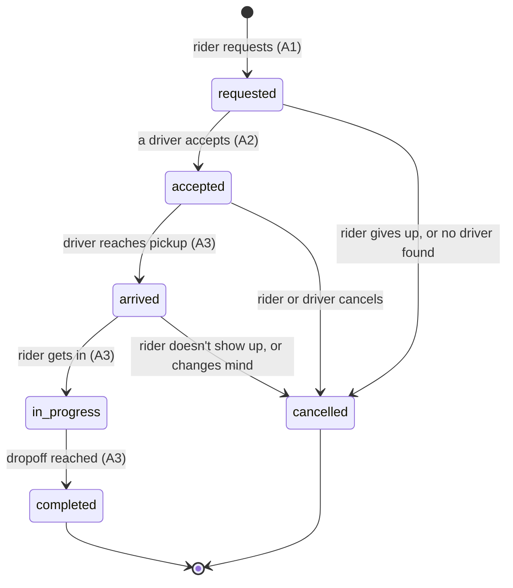

# 3. Decisions: the hard questions

Each answer names the requirement it serves (R1 to R8, A1 to A5, from
[1. Requirements](1-requirements.md)) and the exact constraint, trigger, or index in
[`sql/001_schema.sql`](../sql/001_schema.sql) that enforces it.

- [Normalisation](#normalisation)
- [Money](#money)
- [Status and state](#status-and-state)
- [Time and deletion](#time-and-deletion)
- [Identifiers](#identifiers)
- [Constraints](#constraints)
- [Indexes](#indexes)

---

## Normalisation

**The default: each fact lives in one place.** A driver's name is in `drivers`. A car's plate is in
`vehicles`. A price list is in `fare_rules`. Everything else points to them by id.

**Four deliberate exceptions.** Each one copies a fact on purpose, because the copy means something
different from the original.

### 1. The driver's name and car on the trip (`driver_name_snapshot`, `vehicle_plate_snapshot`, `vehicle_description_snapshot`)

When a driver accepts, their name and car are **copied** onto the trip (query `A2_accept`).

The copy doesn't mean "who is this driver"; it means **"who picked me up that day, in which car"**
(R6). If the driver changes their name, or swaps their Corolla for a Camry next month, a trip from
today must still say Corolla. A rider reporting a lost bag, or a safety complaint, depends on the
record showing the car that actually came. Looking it up through `drivers` and `vehicles` would
show today's details, which would be wrong for every old trip.

The copies can never contradict the trip's ids at the moment they're written, because
`A2_accept` reads them from the same `drivers` and `vehicles` rows it links. After that, they are
history and are meant to stay as they were.

### 2. The price on the trip (`quoted_fare_minor`, `final_fare_minor`, and `fare_rule_id`)

The trip stores **the price itself**, not only "calculate it from the price list".

Prices change: Lagos went from ₦120/km to ₦150/km on 1 July in the sample data. A trip from June
must still cost what it cost in June (R3). So the trip keeps:

- `fare_rule_id`: *which* price list applied when the ride was requested. Price lists are never
  edited or deleted, so this always points at the right one.
- `quoted_fare_minor`: the price the rider was shown and agreed to. It can never change afterwards
  (the `trips_fixed_at_request` check in the `trips_guard_update` trigger).
- `final_fare_minor`: what they actually pay, worked out at the end from the real distance and time,
  **using that same price list**, not whatever is current (query `A3_complete`).

Why store the final fare instead of recalculating it whenever it's needed? Because it's a money
amount somebody was charged. It must be a fixed fact, not the output of a formula someone might
change. The rounding rule in `calculate_fare` could be improved next year, and every old receipt
would silently change.

### 3. Rating totals on the driver and rider (`rating_sum`, `rating_count`)

A driver's average rating is shown on every trip offer a rider sees. Working it out each time
means reading every rating that driver has ever had, possibly thousands, on the most common
screen in the app. So `drivers` keeps a running total and count, and the average is
`rating_sum / rating_count`.

The danger with any copy is that it drifts out of step. Three things prevent that:

- The `ratings_apply` trigger updates the totals **in the same transaction** as the rating insert.
  Either both happen or neither does.
- Ratings can't be deleted or change score (`ratings_guard` trigger), so a total never needs to be
  reduced.
- `drivers_rating_totals_consistent` checks that the sum is between 1× and 5× the count, which
  catches a corrupted total.

I store a sum and a count, not a stored average. Two integers can be updated exactly. A decimal
average would have to be recalculated, and would pick up rounding errors.

### 4. The amount on the payment (`payments.amount_minor`)

A payment stores its amount even though it's the same as the trip's final fare. A payment is a
record of what was actually charged, and it must survive on its own for audits and refunds.

Normally a copy like this could drift from the original. This one can't:
`payments_match_trip_final_fare` is a foreign key on `(trip_id, amount_minor, currency)` pointing
at the trip's `(id, final_fare_minor, currency)`. So:

- the payment amount must **exactly equal** the trip's final fare, or the insert is rejected
  (invalid state 3 in the proof);
- a trip without a final fare, i.e. not completed, can't be paid at all;
- `ON UPDATE RESTRICT`: once a payment exists, the trip's final fare can't be changed underneath it.

So this copy is **enforced to be identical** by the database, which gets the benefit of the copy
without the risk.

---

## Money

**Rule: every amount of money is a whole number (`bigint`) of the smallest unit (kobo), with a
`currency` column next to it (R8).** ₦4,150 is stored as `415000` with `NGN`.

Applied everywhere:

| Table        | Money columns                                                                    | Currency column |
| ------------ | -------------------------------------------------------------------------------- | --------------- |
| `fare_rules` | `base_fare_minor`, `per_km_minor`, `per_minute_minor`, `minimum_fare_minor`      | `currency`      |
| `trips`      | `quoted_fare_minor`, `final_fare_minor`                                          | `currency`      |
| `payments`   | `amount_minor`                                                                   | `currency`      |

- **No decimals or floats for money.** A float can't store 0.1 exactly, so adding thousands of fares
  drifts by kobo. Integers are exact.
- **Rounding happens once, on purpose.** `calculate_fare` does its sums as exact decimals, then
  rounds the final fare to the nearest ₦50 and returns an integer. Nothing after that rounds again.
- **Currencies can't be mixed.** A trip's currency must match its price list
  (`trips_fare_rule_fkey` covers `(fare_rule_id, city, currency)`), and a payment's currency must
  match the trip (`payments_match_trip_final_fare`).
- **`bigint`, not `integer`.** `integer` tops out around 2.1 billion kobo, which is ₦21 million.
  Company-level totals pass that quickly.

Distances and times are also whole numbers (metres, seconds), for the same reason: they feed into
the fare.

---

## Status and state

A trip moves through these statuses:

### Allowed changes

| From          | To            | Who               |
| ------------- | ------------- | ----------------- |
| `requested`   | `accepted`    | driver            |
| `requested`   | `cancelled`   | rider, or system (no driver accepted in time) |
| `accepted`    | `arrived`     | driver            |
| `accepted`    | `cancelled`   | rider or driver   |
| `arrived`     | `in_progress` | driver            |
| `arrived`     | `cancelled`   | rider or driver (e.g. rider didn't show up) |
| `in_progress` | `completed`   | driver            |

### Forbidden changes, and why

Everything not in the list above is forbidden. The important ones:

| Forbidden                          | Why                                                                                   |
| ---------------------------------- | ------------------------------------------------------------------------------------- |
| `completed` → anything             | A finished trip has been charged and maybe rated. Reopening it would make the payment and rating point at a trip that isn't finished. |
| `cancelled` → anything             | A cancelled request doesn't come back to life; the rider requests again, which is a new trip. |
| **`in_progress` → `cancelled`**    | **The non-obvious one.** Once the rider is in the car, the trip can't be "cancelled"; it has to end as `completed`, with a fare for the distance actually driven. A cancelled trip has no fare. So allowing this would turn every ride into a free one, and leave no record that the rider was ever in the car, which is exactly what a safety investigation needs. If a trip ends early (breakdown, rider gets out), it is *completed* at that point with the real distance. |
| `accepted` → `in_progress`         | Skipping `arrived` loses the moment the driver reached the pickup. No-show and waiting disputes depend on that timestamp. |
| Any backwards step                 | E.g. `arrived` → `accepted`. The timestamps would stop making sense.                  |

The `in_progress` → `cancelled` problem is easy to miss, because "cancel" feels like it should be
possible any time before the end. Drawing the diagram shows that cancelling and completing are both
ways a trip *ends*, and only one of them charges money.

### What enforces it

Four layers, from the one that decides to the ones that catch mistakes:

1. **`trip_status_transitions` table + `trips_guard_update` trigger.** On every update that changes
   `status`, the trigger checks the pair `(old status, new status)` exists in the table, and raises
   `trips_allowed_transition` if not. The allowed changes are data, so they can be read and
   reviewed, rather than buried in `if` statements.
2. **`trips_guard_insert` trigger.** A new trip can only be inserted as `requested`. Without this,
   someone could insert a trip that is already `completed` and skip every rule.
3. **Check constraints per status.** Each status requires its own data: `accepted` needs a driver,
   a car, and `accepted_at` (`trips_accepted_has_driver_and_car`). `completed` needs a final fare,
   `completed_at`, and the real distance (`trips_completed_iff_final_fare`), and so on. A row's
   columns can't disagree with its status.
4. **Conditional updates in the queries.** Every change includes the status it expects, e.g.
   `A2_accept` has `where status = 'requested'`. If two drivers accept at the same moment, the
   first changes the row and the second changes nothing (0 rows), which the API turns into
   `409 TRIP_ALREADY_TAKEN`.

Proof: invalid states 4 (completed → in_progress) and 6 (in_progress → cancelled) in
[`docs/evidence/invalid-inserts.txt`](evidence/invalid-inserts.txt).

### Payments have a smaller lifecycle

`pending` → `succeeded` or `failed`; `succeeded` → `refunded`. `payments_one_live_per_trip` allows
at most one `pending` or `succeeded` payment per trip. A declined card (`failed`) can be followed
by a new attempt, but a trip can never have two charges going through.

---

## Time and deletion

**Every entity has `created_at` and `updated_at`.** `updated_at` is set by a trigger
(`set_updated_at`) on every change, so it can't be forgotten. The only table without them is
`trip_status_transitions`, which is fixed configuration, not an entity.

**Soft or hard delete, per entity:**

| Entity        | How it's deleted                              | Why                                                                                 |
| ------------- | --------------------------------------------- | ----------------------------------------------------------------------------------- |
| `riders`      | **Soft delete + anonymise**: `deleted_at` set, name, phone, and email removed | Nigeria's Data Protection Act 2023 gives people the right to have their personal data erased. But their trips and payments are financial records that must be kept for tax and audit (R7). Removing the personal details and keeping the row satisfies both: the trips still point at a rider, but nobody can tell who. |
| `drivers`     | **Soft delete + anonymise**, same as riders   | Same reasons. A deleted driver must also be offline (`drivers_deleted_is_offline`). |
| `vehicles`    | **Soft delete** (`deleted_at`)                | Old trips point at the car. A retired car's plate can be registered again, because the plate uniqueness only counts cars that aren't deleted (`vehicles_plate_in_use`). |
| `trips`       | **Never deleted**                             | Financial and safety record. "Cancel" is a status, not a deletion.                 |
| `payments`    | **Never deleted**                             | Financial record. A refund is a status change, and the history stays.             |
| `ratings`     | **Never deleted**                             | Deleting one would break the totals on the driver. An abusive comment can be edited out, but the score stays (`ratings_guard`). |
| `fare_rules`  | **Never deleted or edited**                   | Old trips point at them (R3). A price change closes the old list and adds a new one. |

Two check constraints make deletion safe and complete:

- `riders_deleted_is_anonymised`: a deleted rider **must** have no name, phone, or email. A
  "deletion" that forgot to remove the phone number is impossible.
- `riders_live_has_details`: a live rider must have them.

So `deleted_at` only appears on the three tables that can actually be deleted. The rest have no
`deleted_at` column, because a column nobody should set is a mistake waiting to happen.

---

## Identifiers

**Every id is a random UUID (version 4) generated by the database** (`default gen_random_uuid()`),
never a counting number.

The security reason: with counting ids, `GET /trips/1`, `/trips/2`, `/trips/3`… walks through every
trip anyone has taken, including pickup and dropoff addresses, which reveal where people live and
work. Even when access checks stop that, counting ids leak business numbers: a rider who gets trip
`48213` today and `48913` tomorrow knows the service did about 700 trips in a day. A random UUID
has 122 random bits, so ids can't be guessed, walked, or used to count anything.

The database generates them, not the app, so every row gets one whichever code path inserts it.
Idempotency keys (`request_key`, `idempotency_key`) are **not** ids. They are chosen by the client
to recognise a retried request, and they are only ever compared, never used to look records up
from a URL.

---

## Constraints

### Per table

| Table        | Unique                                                                                      | Foreign keys                                                                                     | Checks and triggers                                                                            |
| ------------ | ------------------------------------------------------------------------------------------- | ------------------------------------------------------------------------------------------------ | ---------------------------------------------------------------------------------------------- |
| `fare_rules` | `fare_rules_id_city_currency` (target for trips); `fare_rules_no_overlap` (exclusion: same city, overlapping dates) | none                                                                         | valid period; amounts ≥ 0; currency is 3 capital letters                                        |
| `riders`     | `phone`, `email`                                                                            | none                                                                                             | phone format; `riders_live_has_details`; `riders_deleted_is_anonymised`; `riders_rating_totals_consistent` |
| `drivers`    | `phone`, `licence_number`                                                                   | none                                                                                             | same pattern as riders; `drivers_deleted_is_offline`                                           |
| `vehicles`   | `vehicles_id_driver` (target for trips); `vehicles_one_active_per_driver` (partial); `vehicles_plate_in_use` (partial) | `driver_id` → drivers                                                | year range; `vehicles_deleted_is_inactive`                                                     |
| `trips`      | `trips_request_key_unique`; `trips_one_active_per_rider` (partial); `trips_one_active_per_driver` (partial); `trips_id_status`, `trips_id_final_fare` (targets) | `rider_id` → riders; `driver_id` → drivers; `trips_fare_rule_fkey` (rule, city, currency); `trips_vehicle_belongs_to_driver` (car, driver) | status list; one check per status; `trips_times_in_order`; `trips_pickup_differs_from_dropoff`; triggers `trips_guard_insert`, `trips_guard_update` |
| `payments`   | `payments_idempotency_key_unique`; `payments_provider_reference_unique`; `payments_one_live_per_trip` (partial) | `payments_match_trip_final_fare` (trip, amount, currency)                                  | method and status lists; `payments_card_success_has_reference`; `payments_cash_has_no_reference`; `payments_failed_iff_reason` |
| `ratings`    | `ratings_once_per_side`                                                                     | `ratings_trip_must_be_completed` (trip, `'completed'`)                                           | score 1 to 5; comment ≤ 500 characters; trigger `ratings_guard`                                |

### Which invalid states are now impossible?

| Invalid state                                                          | What stops it                                             | Proven |
| ---------------------------------------------------------------------- | --------------------------------------------------------- | ------ |
| **A rider with two active trips** (R1)                                 | `trips_one_active_per_rider`: a unique index on `rider_id`, only counting trips that aren't finished | test 1 |
| A driver with two active trips (R2)                                    | `trips_one_active_per_driver`                             |        |
| **A rating for a trip that isn't completed** (R5)                      | `ratings_trip_must_be_completed`                          | test 2 |
| Two ratings from the same side for one trip (R5)                       | `ratings_once_per_side`                                   |        |
| **A payment for the wrong amount, or for an unfinished trip** (R4)     | `payments_match_trip_final_fare`                          | test 3 |
| A trip charged twice (R4)                                              | `payments_one_live_per_trip`, `payments_idempotency_key_unique` |   |
| **A finished trip reopened**                                           | `trips_allowed_transition` (trigger + transitions table)  | test 4 |
| **Cancelling a trip the rider is already in**                          | `trips_allowed_transition`                                | test 6 |
| **Two price lists for the same city at the same time** (R3)            | `fare_rules_no_overlap`                                   | test 5 |
| A trip priced with another city's price list, or in another currency   | `trips_fare_rule_fkey`                                    |        |
| A trip recording a car that belongs to a different driver              | `trips_vehicle_belongs_to_driver`                         |        |
| A trip created already finished, skipping every rule                   | `trips_start_as_requested` (`trips_guard_insert`)         |        |
| A completed trip with no fare, or a fare on an unfinished trip         | `trips_completed_iff_final_fare`                          |        |
| A driver with two cars in use                                          | `vehicles_one_active_per_driver`                          |        |
| A "deleted" rider whose phone number is still stored                   | `riders_deleted_is_anonymised`                            |        |
| A trip's quoted price changed after the rider agreed to it (R3)        | `trips_fixed_at_request` (`trips_guard_update`)           |        |

The rows in **bold** were tested by trying them against the real database. Every one was
rejected by the named constraint: [`docs/evidence/invalid-inserts.txt`](evidence/invalid-inserts.txt).

**How the rating rule works**, since it's the least usual. A foreign key normally says "this trip
must exist". `ratings_trip_must_be_completed` points at **two** columns on the trip, `(id, status)`,
and the rating's side of it is a column that is always `'completed'`. So it says "a trip must
exist with this id **and** status `completed`". The database checks that on every insert. And
because of `ON UPDATE RESTRICT`, a rated trip's status can never change again.

---

## Indexes

One index per query the five actions run. Nothing is indexed "just in case"; every index slows
down writes and takes space, so each one has to serve a real query.

| Action | Query                                  | Index                                                                   | Why this shape                                                                 |
| ------ | -------------------------------------- | ----------------------------------------------------------------------- | ------------------------------------------------------------------------------ |
| A1     | `A1_request_ride`: current price list  | the gist index behind `fare_rules_no_overlap`                           | the constraint's own index answers "which list covers now, for Lagos". With only 3 price lists today, Postgres just reads the table; the index matters as price history grows |
| A1     | `A1_request_ride`: one active trip?    | `trips_one_active_per_rider`                                            | the insert checks it anyway; it's also how "my current trip" is found          |
| A2     | `A2_find_nearby_requests`              | `trips_open_requests_location (pickup_lat, pickup_lng) where status = 'requested'` | partial: only the ~120 waiting requests are in it, not the 20,000 finished trips |
| A2     | `A2_accept`                            | primary key; `trips_one_active_per_driver`                              |                                                                                |
| A3     | `A3_arrive`, `A3_start`, `A3_complete` | primary key                                                             | each updates one trip by id                                                    |
| A4     | `A4_pay`                               | `payments_idempotency_key_unique`; `payments_one_live_per_trip`         | the retry check and the double-charge check                                    |
| A5     | `A5_trip_history`                      | `trips_rider_history (rider_id, requested_at desc, id desc)`            | finds one rider's trips already in the order the screen shows them; `id` makes the order exact for cursor pagination |
| A5     | `A5_trip_history` (the rating shown)   | `ratings_once_per_side (trip_id, rater_role)`                           | the unique constraint doubles as the lookup                                    |
| A5     | `A5_rate`                              | `ratings_once_per_side`                                                 |                                                                                |

Other indexes, each for a named screen: `trips_driver_completed` (driver's earnings list),
`vehicles_driver` (driver's list of cars), `payments_trip` (a trip's payments).

**Not indexed on purpose:** `trips.fare_rule_id`. Nothing searches trips by price list, and the
index would only help when deleting a price list, which never happens.

The query plans for the two heaviest reads are in
[`docs/evidence/query-plans.txt`](evidence/query-plans.txt). Both use their index: an Index Scan
on `trips_open_requests_location` and on `trips_rider_history`, each finishing in about 0.1 ms
over 20,000 trips.
